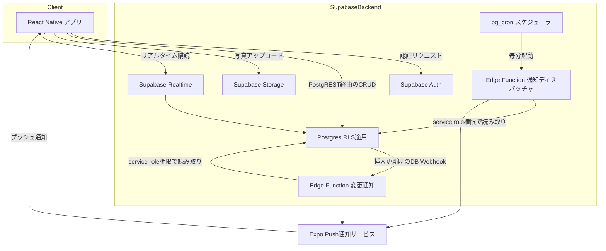
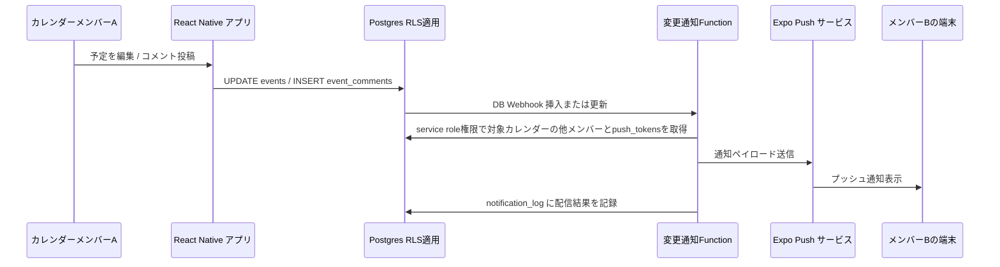
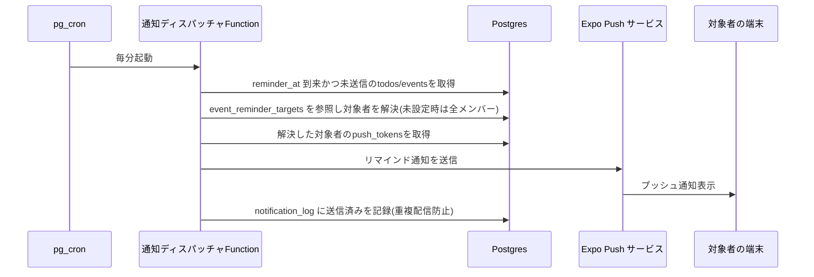
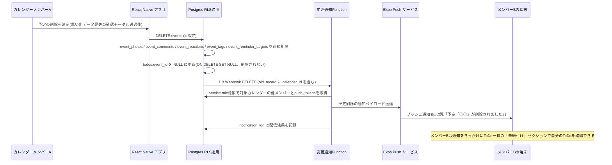
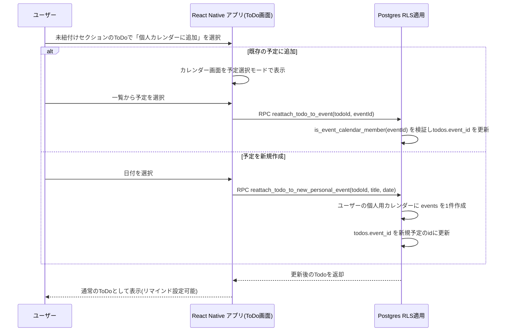
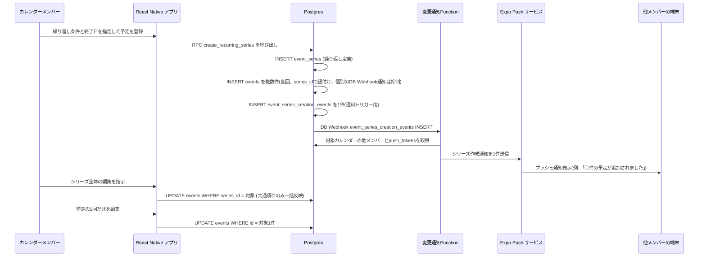
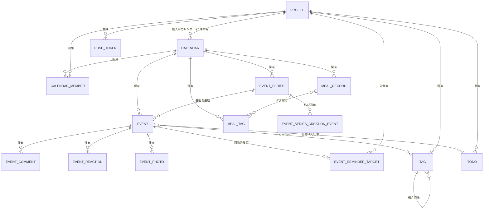
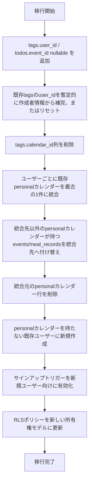

# 技術設計書

## 概要

**目的**: 本機能は、家族・カップル・友人グループなど複数人が予定を共有できるカレンダー基盤に、ToDo管理・階層タグ付け・タグ別の一覧振り返り・実施済み予定の思い出化・献立記録を統合したモバイルアプリケーションを提供する。予定・写真は複数人で共有する一方、タグ・ToDoはユーザー個人が所有する情報として明確に分離する。

**利用者**: 日常の予定を複数人で共有・管理したいユーザーが、予定登録から準備(ToDo)、実施、振り返り(思い出・履歴)、日々の食事記録までを1つのアプリで完結させる。各ユーザーはサインアップ時に自動付与される個人用カレンダー(「Myカレンダー」)を持ち、共有カレンダーとは独立して自分だけの予定・ToDoを管理できる。

**影響**: 既存の共有カレンダー基盤(カレンダー・予定・タグ・ToDo・通知)に対する所有権モデルの変更を伴う拡張。`tags`のカレンダー所有からユーザー所有への変更、`todos`の可視性制限、個人用カレンダーの自動生成、予定削除通知の追加が主な変更点。

### ゴール
- カレンダー共有・予定管理・コミュニケーション(コメント/スタンプ)というTimeTree相当の基盤機能を提供する
- 実施済み予定を写真・コメント付きの「思い出」として、繰り返し予定の各回も含めて個別に振り返り可能にする
- タグ・ToDoをユーザー個人が所有する情報として扱い、参加する複数の共有カレンダーを横断しても一貫した分類・準備管理を行えるようにする
- タグ単位で、参加する全カレンダーを横断して過去の予定を振り返れるようにする
- 予定削除時にもToDoを失わせず、別の予定への再紐付けや個人用カレンダーでの新規予定作成によって復活できるようにする
- 朝食・昼食・夕食・間食単位の献立記録を共有できるようにする
- リマインド通知の対象者を予定ごとに選択できるようにする

### 非ゴール
- 決済・課金機能
- 外部カレンダー(Google/Appleカレンダー等)との同期・インポート
- 位置情報共有・地図連携
- 予定に紐付かない自由なチャット機能
- AIによる自動要約・提案機能、栄養価計算・カロリー管理

## 境界コミットメント

### 本specが担う範囲
- ユーザー認証、共有(グループ)カレンダーの作成・共有・メンバー管理
- サインアップ時の個人用カレンダー(「Myカレンダー」)自動生成と、その一意性の保証
- 予定(events)のCRUD、繰り返し予定の個別データ生成とまとめ操作、月/週/日表示
- 予定へのコメント・スタンプ
- 予定の追加・変更・削除・コメント投稿・リマインドの通知配信と、リマインド対象者の選択
- 実施済み予定(繰り返しの各回を含む)の思い出化(写真・コメント)とタイムライン閲覧
- ユーザー個人が所有するToDo管理とリマインド。予定削除時のToDo保持(紐付け解除)と、既存予定への再紐付け・個人用カレンダーでの新規予定作成による復活
- ユーザー個人が所有する階層タグ(大/中/小分類)。参加する全カレンダーへの共通適用と、タグ絞り込みによるカレンダー横断の一覧振り返り
- 献立記録(朝食/昼食/夕食/間食、独立した献立タグ)

### 本specが担わない範囲
- 決済・サブスクリプション課金(将来spec)
- 外部カレンダーサービスとの同期(将来spec、必要なら別途連携仕様を定義)
- プッシュ通知の配信基盤自体の高度化(キューイング基盤導入等)は本specでは簡易実装(pg_cronポーリング)にとどめ、スケール要求が生じた時点で別specに切り出す
- 栄養価計算・カロリー管理などの献立分析機能
- 献立タグ(`meal_tags`)の個人所有化(カレンダー単位のまま据え置く)
- カレンダー自体の削除UI(個人用カレンダーを除き、本spec範囲外のまま)

### 許容される依存関係
- Supabase(Postgres, Auth, Storage, Realtime, Edge Functions, pg_cron)をマネージドバックエンドとして利用
- Expo / EAS Build をクライアントのビルド・配布基盤として利用
- Expo Push Notification Service をプッシュ配信チャネルとして利用

### 再検証トリガー
- `calendar_members`のロール体系(owner/editor/viewer)や権限判定ロジックの変更
- `events` / `event_series` / `todos` / `tags` テーブルのスキーマ変更(列追加・削除、`series_id`の扱い変更)
- `tags`・`todos`の所有権モデル(ユーザー個人所有)の変更、または個人用カレンダーの一意性保証の変更
- 通知配信の契約(push_tokensの形式、event_reminder_targetsの解決ルール、notification_logのイベント種別)の変更
- 予定の「実施済み」判定基準(`end_at`基準)の変更
- Edge Functionsのservice role権限の利用範囲の変更

## アーキテクチャ

### 既存アーキテクチャ分析
- 現行アーキテクチャは全ドメインテーブルが`calendar_id`(または`event_id`経由)を持ち、`is_calendar_member`/`is_event_calendar_member`のRLSヘルパー1本で認可を統一する設計だった
- 本改訂で`tags`・`todos`は`calendar_id`ベースの認可から外れ、`user_id`/`created_by = auth.uid()`ベースの認可に切り替わる。これは既存の「全テーブルが`calendar_id`経由」という前提から意図的に外れる例外であり、以後この2テーブルを参照する新規機能は認可モデルの違いを踏まえて設計する必要がある
- `handle_new_user()`トリガー(サインアップ時の`profiles`自動作成)は維持しつつ拡張し、個人用カレンダーの自動生成を同一トランザクションに統合する。既存の呼び出し元・契約は変更しない
- `event-change-notifier`の既存の通知集約・冪等性(`notification_log`)の仕組みはそのまま維持し、購読イベントの追加(`DELETE`)のみを行う

### アーキテクチャパターンと境界マップ

**アーキテクチャ統合**:
- 選定パターン: BaaS中心のレイヤードクライアントアーキテクチャ(React Native クライアント + Supabase)。理由は[research.md](research.md)のアーキテクチャパターンの評価を参照。
- ドメイン境界: Postgres上のテーブル群をドメインごとに分離し(Identity/Scheduling/Communication/Tagging/Todo/Meal/Notification)、全ての子テーブルは`calendar_id`を保持してRLSで統一的にアクセス制御する。
- 新規コンポーネントの根拠: Edge Functions(`notification-dispatcher`, `event-change-notifier`)は、共有データの変更を他メンバーへ即時・時限的に知らせるために必要な唯一のサーバーサイド実行ロジック。それ以外の業務ロジックはRLS + クライアントで完結させる。これらのEdge Functionsはservice role権限で動作し、RLSはクライアント直接アクセスにおける認可モデルと位置づける(詳細はセキュリティに関する考慮事項を参照)。



### 技術スタック

| レイヤー | 選定技術/バージョン | 本機能での役割 | 備考 |
|---------|---------------------|----------------|------|
| フロントエンド/クライアント | React Native (Expo SDK 52, TypeScript 5) | iOS/Android共通のモバイルクライアント、カレンダー/ToDo/タグ/思い出/献立の全画面 | Expo Routerでファイルベースルーティング |
| 状態/データアクセス | TanStack Query + supabase-js v2 | サーバー状態のキャッシュ・楽観的更新、Supabase Realtimeとの購読連携 | 詳細は[research.md](research.md) |
| バックエンド/サービス | Supabase Auth, PostgREST(自動生成API), Edge Functions(Deno) | 認証、CRUD API、通知配信ロジック | Edge Functionsは通知ドメインのみに限定 |
| データ/ストレージ | Postgres 16(Supabase managed)、Supabase Storage | リレーショナルデータ全般、思い出/献立の画像 | RLSでカレンダー単位のアクセス制御 |
| メッセージング/イベント | Supabase Realtime(WebSocket)、pg_cron、DB Webhooks、Expo Push Notification Service | カレンダー内リアルタイム同期、リマインド・変更通知の配信 | 選定理由は[research.md](research.md) |
| インフラ/ランタイム | Supabase Cloud、Expo EAS Build/Submit | バックエンドホスティング、モバイルアプリのビルド・配布 | |

## ファイル構成計画

### ディレクトリ構成
```
memory-calendar/
├── app/                          # Expo Router 画面定義
│   ├── (auth)/                   # ログイン・サインアップ (要件1)
│   ├── (tabs)/
│   │   ├── calendar/             # 月/週/日カレンダー表示 (要件4)
│   │   ├── todos/                # ToDo一覧画面 (要件9)
│   │   ├── history/              # タグ絞り込み一覧振り返り (要件11)
│   │   ├── memories/             # 思い出タイムライン (要件7, 8)
│   │   └── meals/                # 献立記録 (要件12)
│   └── event/[id]/               # 予定詳細、コメント・スタンプ・ToDo・タグ・対象者編集 (要件3, 5, 6, 9, 10)
├── src/
│   ├── features/
│   │   ├── auth/                 # service.ts, hooks.ts, types.ts (要件1)
│   │   ├── calendars/            # 共有カレンダーCRUD・招待・メンバー管理・個人用カレンダー取得 (要件2、同一パターンを他featuresも踏襲)
│   │   ├── events/                # 予定CRUD・繰り返しシリーズ生成・まとめ操作 (要件3, 4)
│   │   ├── communication/        # コメント・スタンプ (要件5)
│   │   ├── tags/                  # ユーザー個人所有の階層タグCRUD・絞り込みクエリ (要件10, 11)
│   │   ├── todos/                 # ユーザー個人所有のToDo CRUD・リマインド設定・孤立ToDoの復活 (要件9)
│   │   ├── memories/              # 思い出クエリ・写真添付 (要件7, 8)
│   │   ├── meals/                 # 献立記録CRUD (要件12)
│   │   └── notifications/         # Push Token登録・通知受信ハンドリング (要件6, 9.3)
│   ├── shared/
│   │   ├── api/supabaseClient.ts # supabase-js 初期化(Types → Config → Repository → Service → Runtime → UI の起点)
│   │   ├── components/           # 横断UIコンポーネント
│   │   └── types/database.ts     # Supabase CLIで生成するDB型定義
│   └── navigation/
├── supabase/
│   ├── migrations/               # スキーマ・RLSポリシーのSQLマイグレーション
│   └── functions/
│       ├── notification-dispatcher/   # pg_cron起動、リマインド配信 (要件6.4-6.6, 9.3)
│       └── event-change-notifier/     # DB Webhook起動、追加・変更・削除・コメント通知 (要件6.1-6.3, 6.7)
└── eas.json / app.json
```

> 各`features/*`ディレクトリは `service.ts`(Supabaseクエリ)・`hooks.ts`(TanStack Queryフック)・`types.ts`(ドメイン型)の同一パターンに従う。個別のUIコンポーネントは対応する`app/`配下の画面ファイルに配置し、featuresディレクトリはロジックとデータアクセスに限定する。

### 変更対象ファイル
本spec改訂(タグ/ToDoの個人所有化、個人用カレンダー自動生成、予定削除通知)による主な変更対象:

- `supabase/migrations/` — `tags.calendar_id → user_id`への変更、`todos.event_id`のnullable化と`ON DELETE SET NULL`化、`calendars`への部分ユニークインデックス追加、サインアップトリガーの拡張、関連RLSポリシーの全面更新、既存データ移行用マイグレーション(Migration Strategy参照)
- `supabase/functions/event-change-notifier/` — `events`テーブルの`DELETE`購読を追加
- `src/features/tags/` — `service.ts`/`hooks.ts`から`calendarId`引数を除去し、`listTagTree()`など個人所有前提のシグネチャに変更
- `src/features/todos/` — `listOrphanedTodos`・`reattachTodoToExistingEvent`・`reattachTodoToNewPersonalEvent`を追加
- `src/features/calendars/` — `getPersonalCalendar`を追加、`createCalendar`を`kind: "group"`固定に変更
- `app/(tabs)/todos/` — 未紐付けセクションと復活操作(既存予定選択/個人カレンダーでの新規作成)のUIを追加
- `app/(tabs)/history/` — カレンダー横断のタグ絞り込みUIに変更(カレンダー選択は任意の追加絞り込みに変更)
- カレンダー設定・予定作成/編集フォームのタグピッカー — カレンダー切り替えと独立して個人のタグ一覧を表示するように変更

## システムフロー

### 予定変更・コメント投稿の通知フロー


### ToDo・予定リマインドの配信フロー


**主な決定事項**: 通知起点を「DB Webhook(即時系)」と「pg_cronポーリング(時刻起点系)」の2系統に分離し、いずれも同一の`notification_log`で冪等性(重複配信防止)を担保する。リマインド系(6.4-6.6, 9.3)のみ`event_reminder_targets`による対象者絞り込みを行い、追加・変更・コメント・削除通知(6.1-6.3, 6.7)は引き続き全メンバーへブロードキャストする。

### 予定削除→ToDo孤立化→通知フロー


**主な決定事項**: `todos.event_id`は`ON DELETE CASCADE`ではなく`ON DELETE SET NULL`とし、予定削除時にToDo自体は削除しない(9.7)。これにより、予定削除者が他メンバーの非公開ToDoを意図せず消してしまう事態を避ける。`EventChangeNotifier`は`events`テーブルの`DELETE`も購読し、DB Webhookの`old_record`から削除前の`calendar_id`を取得して通知対象を解決する(6.7)。

### ToDo復活フロー(既存予定への再紐付け/個人用カレンダーでの新規予定作成)


**主な決定事項**: どちらの復活操作も、ToDoの`created_by`(所有者)がAPI呼び出し本人であることをRLS/RPC双方で検証する。「既存の予定に追加」は本人が閲覧可能な任意の予定(個人・共有を問わない)を対象にできるが、「予定を新規作成」は必ずユーザー自身の個人用カレンダーに作成し、他者に共有されないことを保証する(9.9, 9.10)。

### 繰り返し予定の生成・まとめ編集フロー


**主な決定事項**: 繰り返し予定は登録時点で各回を実データ化する(仮想展開しない)。これにより写真・コメント・ToDo・タグの紐付けが回ごとに自然に独立し、思い出化要件(7.6)を追加実装なしに満たす。繰り返しの終了日指定を必須とし開始日から1年以内に制限する(3.4)ことで、無期限シリーズの延伸処理は不要となり、生成件数の上限も保証される。`events`の一括INSERT(`series_id IS NOT NULL`)に対する`EventChangeNotifier`の個別通知は抑制し、`event_series_creation_events`への1件のINSERTを介してシリーズ作成につき1件のみ通知する(6.1、詳細は[research.md](research.md)参照)。

## 要件トレーサビリティ

| 要件 | 概要 | コンポーネント | インターフェース | フロー |
|------|------|----------------|-------------------|--------|
| 1.1-1.5 | ユーザー登録・ログイン | AuthService | Service | - |
| 2.1-2.6 | 共有カレンダーの作成・共有・メンバー管理 | CalendarService | Service, API(PostgREST) | - |
| 2.7-2.9 | 個人用カレンダーの自動生成と一意性保証 | CalendarService(サインアップトリガー) | Service, State | - |
| 3.1-3.9 | 予定の登録・編集・削除(削除確認を含む)・繰り返しシリーズ(終了日必須・最大1年) | EventService | Service, API | 繰り返し予定の生成・まとめ編集フロー |
| 3.10 | 予定削除時のToDo保持 | EventService, TodoService | Service | 予定削除→ToDo孤立化→通知フロー |
| 4.1-4.4 | カレンダー表示・閲覧 | EventService(参照) | Service | - |
| 5.1-5.4 | コメント・スタンプ | CommunicationService | Service, API | 変更通知フロー |
| 6.1-6.6 | 通知・リマインド対象者選択 | EventService(対象者設定・リマインダー時刻設定), NotificationDispatcher, EventChangeNotifier | Service, Event, Batch | 変更通知フロー、繰り返し予定の生成・まとめ編集フロー |
| 6.7 | 予定削除通知 | EventChangeNotifier | Event | 予定削除→ToDo孤立化→通知フロー |
| 7.1-7.6 | 実施済み予定の思い出化 | MemoryService | Service | 繰り返し予定の生成・まとめ編集フロー |
| 8.1-8.5 | 思い出の振り返り・閲覧 | MemoryService | Service | - |
| 9.1-9.6 | ToDo管理機能(作成者本人にのみ表示) | TodoService | Service, API | - |
| 9.7-9.8 | 予定削除時のToDo孤立化・専用セクション表示 | TodoService | Service | 予定削除→ToDo孤立化→通知フロー |
| 9.9-9.10 | 孤立ToDoの復活(既存予定への再紐付け/個人カレンダーでの新規予定作成) | TodoService, EventService | Service | ToDo復活フロー |
| 10.1-10.10 | タグづけ機能(ユーザー個人所有、削除確認モーダル・カスケード削除を含む) | TagService | Service, API | - |
| 11.1-11.6 | 一覧振り返り機能(カレンダー横断) | HistoryService | Service | - |
| 12.1-12.7 | 献立記録機能 | MealRecordService | Service, API | - |

## コンポーネントとインターフェース

| コンポーネント | ドメイン/レイヤー | 目的 | 対応要件 | 主要依存関係(P0/P1) | 契約 |
|----------------|-------------------|------|----------|----------------------|------|
| AuthService | Identity | サインアップ・ログイン・セッション管理 | 1.1-1.5 | Supabase Auth (P0) | Service |
| CalendarService | Identity/Membership | 共有カレンダーCRUD・招待・メンバー管理・個人用カレンダーの自動生成 | 2.1-2.9 | AuthService (P0) | Service, API, State |
| EventService | Scheduling | 予定CRUD(削除確認含む、削除時のToDo保持を含む)・繰り返しシリーズ生成(終了日必須・最大1年)/まとめ操作・リマインダー時刻/対象者設定・表示用クエリ | 3.1-3.10, 4.1-4.4, 6.4, 6.5 | CalendarService (P0) | Service, API |
| CommunicationService | Communication | コメント・スタンプのCRUD | 5.1-5.4 | EventService (P0) | Service, API |
| TagService | Tagging | ユーザー個人所有の階層タグCRUD・予定への紐付け・削除確認とカスケード削除 | 10.1-10.10 | AuthService (P0) | Service, API |
| TodoService | Todo | ユーザー個人所有のToDo CRUD・リマインド設定・孤立ToDoの一覧と復活(既存予定への再紐付け/個人カレンダーでの新規予定作成) | 9.1-9.10 | EventService (P0) | Service, API |
| MemoryService | Memory | 実施済み予定(回ごと)の抽出・写真/コメント付与・思い出一覧 | 7.1-7.6, 8.1-8.5 | EventService (P0), Storage (P1) | Service |
| HistoryService | History | ユーザー個人のタグ絞り込みによる、参加カレンダー横断の過去予定検索 | 11.1-11.6 | EventService (P0), TagService (P0) | Service |
| MealRecordService | Meal | 献立記録CRUD・献立タグ管理 | 12.1-12.7 | CalendarService (P0) | Service, API |
| EventChangeNotifier | Notification | 予定の追加・変更・削除・コメント投稿の即時通知 | 6.1-6.3, 6.7 | EventService (P0), Expo Push (P0), Supabase service role (P0) | Event |
| NotificationDispatcher | Notification | リマインドの時刻起点配信・対象者解決 | 6.4-6.6, 9.3 | TodoService (P0), EventService (P0), Expo Push (P0), Supabase service role (P0) | Batch |

UI画面(`app/`配下)はいずれも対応するServiceのフックを呼び出すのみで新規の境界を持たないため、個別の詳細ブロックは省略する。

### Identity / Membership

#### CalendarService

| 項目 | 内容 |
|------|------|
| 目的 | 共有カレンダーの作成、招待コード発行、メンバー参加・削除、所属カレンダーの切り替え、個人用カレンダーの自動生成を担う |
| 対応要件 | 2.1, 2.2, 2.3, 2.4, 2.5, 2.6, 2.7, 2.8, 2.9 |

**責務と制約**
- カレンダー・`calendar_members`・`calendar_invites`の整合性を保つ唯一のオーナー
- ロールは`owner` / `editor` / `viewer`の3種とし、招待発行は`owner`と`editor`のみ許可
- カレンダー削除は`owner`のみ許可(本specでは削除UIは必須要件外だが、データ整合性上ロールに反映する)
- `createCalendar`は常に`kind: "group"`のカレンダーを作成する。クライアントからの`calendars`直接INSERTも`kind = 'group'`のみをRLSで許可し、`kind: "personal"`はサインアップトリガー(SECURITY DEFINER)経由でのみ作成可能とする(2.8)
- サインアップ完了(`auth.users`へのINSERT)をトリガーに、`profiles`行の作成と同一トランザクションで個人用カレンダー(`kind: "personal"`, `name: "Myカレンダー"`)を1件作成し、当該ユーザーを`owner`として登録する(2.7)。個人用カレンダーには招待機能を提供しない(2.9)
- `calendars(created_by) where kind = 'personal'`への部分ユニークインデックスにより、1ユーザー1個人用カレンダーの不変条件をDBレベルで保証する(2.8)

**依存関係**
- Inbound: EventService, TagService(所属確認はTagServiceからは切り離し済み、個人用カレンダー経由の予定作成のみ), TodoService, MealRecordService — いずれも`calendar_id`の所属確認に依存(P0)
- Outbound: なし
- External: Supabase Auth — ユーザー同一性の確認、サインアップイベントの起点(P0)

**契約**: Service [x] / API [x] / Event [ ] / Batch [ ] / State [x]

##### サービスインターフェース
```typescript
interface CalendarService {
  createCalendar(input: CreateCalendarInput): Promise<Result<Calendar, CalendarError>>;
  createInvite(calendarId: string): Promise<Result<CalendarInvite, CalendarError>>;
  joinByInvite(inviteCode: string): Promise<Result<CalendarMembership, CalendarError>>;
  listMembers(calendarId: string): Promise<Result<CalendarMember[], CalendarError>>;
  removeMember(calendarId: string, userId: string): Promise<Result<void, CalendarError>>;
  getPersonalCalendar(): Promise<Result<Calendar, CalendarError>>;
}

interface CreateCalendarInput {
  name: string;
}

type CalendarError =
  | { type: "NotFound" }
  | { type: "Forbidden" }
  | { type: "InviteExpired" }
  | { type: "ValidationError"; field: string };
```
- 事前条件: `createInvite`/`removeMember`は呼び出しユーザーが対象カレンダーの`owner`または`editor`であること
- 事後条件: `joinByInvite`成功時、呼び出しユーザーは`calendar_members`に`role: viewer`以上で追加される。`getPersonalCalendar`は常に1件のカレンダーを返す(呼び出し時点で個人用カレンダーが存在しない状態は発生しない)
- 不変条件: 1カレンダーに`owner`は最低1人存在する。1ユーザーにつき`kind: "personal"`のカレンダーは常に1件

##### State Management
- 状態モデル: 個人用カレンダーの存在は「ユーザーアカウントのライフサイクルに従属する状態」として扱う。生成はサインアップトリガーが担い、クライアントは`getPersonalCalendar`で参照するのみで生成操作は行わない
- 永続化と整合性: `auth.users`へのINSERTと同一トランザクション内で`calendars`/`calendar_members`行を作成し、部分的な生成失敗(カレンダーのみ作成されメンバーシップが欠落する等)が起きないようにする
- 並行性戦略: トリガーはユーザーごとに1回のみ実行されるため、通常運用下での競合は発生しない

##### APIコントラクト
| メソッド | エンドポイント | リクエスト | レスポンス | エラー |
|----------|----------------|-----------|-----------|--------|
| POST | /rest/v1/calendars | CreateCalendarInput | Calendar | 400, 401 |
| POST | /rest/v1/calendar_invites | { calendarId } | CalendarInvite | 401, 403 |
| POST | /rest/v1/calendar_members (RPC join_by_invite) | { inviteCode } | CalendarMembership | 401, 404, 410 |

**実装上の注意**
- 統合: PostgRESTの自動生成APIをそのまま利用し、`joinByInvite`のみ招待コード検証ロジックを含むためRPC(Postgres関数)化する
- 検証: 招待コードの有効期限切れは410相当のドメインエラー`InviteExpired`として返す
- リスク: 招待リンクの総当たり推測を防ぐため、コードは十分なエントロピー(UUIDv4相当)を持たせる

### Scheduling

#### EventService

| 項目 | 内容 |
|------|------|
| 目的 | 予定のCRUD(削除確認を含む)、繰り返しシリーズの生成・まとめ操作、リマインダー時刻・対象者設定、カレンダー表示用の期間クエリを提供する |
| 対応要件 | 3.1, 3.2, 3.3, 3.4, 3.5, 3.6, 3.7, 3.8, 3.9, 3.10, 4.1, 4.2, 4.3, 4.4, 6.4, 6.5 |

**責務と制約**
- `events`テーブルの整合性(終了日時 >= 開始日時)を保証する唯一の書き込み境界
- 繰り返し予定は終了日の指定を必須とし、開始日から終了日までが1年を超える場合は登録を拒否する(3.4)。登録時に`event_series`(繰り返し定義)を1件作成し、開始日から終了日までの各回の`events`行を実データとして生成する(仮想展開ではなく事前生成方式。理由は[research.md](research.md)参照)。終了日必須化により、無期限シリーズの生成horizon延伸処理は不要となる
- 「まとめて編集・削除」(3.6)は同一`series_id`を持つ全`events`行への一括更新として実装し、日時(`start_at`/`end_at`)以外の共通項目(タイトル・場所・メモ・カテゴリ)を対象とする。日時変更は常に個別回(`this`スコープ)に対して行う
- 予定削除(`deleteEvent`)は、紐づく`event_tags`・`event_reminder_targets`・`event_photos`・`event_comments`・`event_reactions`をカスケード削除する。一方`todos`は削除せず`event_id`を`NULL`に更新する(`ON DELETE SET NULL`、3.10)。クライアントは削除確定前に「思い出データ(写真・コメント)も削除されます」という確認モーダルを表示する(3.9、UI層の責務)。ToDoは保持される旨は要件9.7のTodoService側の責務として扱う
- 「実施済み」判定(`end_at < now()`)はMemoryService/HistoryServiceが本コンポーネントの読み取りクエリを再利用する形で行い、独自のフラグは持たない
- 予定のリマインダー時刻(6.4)は`events.reminder_at`として保持し、`createEvent`/`updateEvent`の入力項目に含める。リマインド対象者(6.5)は`event_reminder_targets`への書き込みとしてEventServiceが管理する

**依存関係**
- Inbound: CommunicationService, TagService, TodoService, MemoryService, HistoryService, EventChangeNotifier, NotificationDispatcher(P0)
- Outbound: CalendarService — `calendar_id`の所属確認(P0)
- External: なし

**契約**: Service [x] / API [x] / State [ ]

##### サービスインターフェース
```typescript
interface EventService {
  createEvent(input: CreateEventInput): Promise<Result<Event, EventError>>;
  createRecurringSeries(input: CreateRecurringSeriesInput): Promise<Result<Event[], EventError>>;
  updateEvent(eventId: string, input: UpdateEventInput, scope: EditScope): Promise<Result<Event | Event[], EventError>>;
  deleteEvent(eventId: string, scope: EditScope): Promise<Result<void, EventError>>;
  setReminderTargets(eventId: string, userIds: string[] | "all"): Promise<Result<void, EventError>>;
  listEventsInRange(calendarId: string, range: DateRange): Promise<Result<Event[], EventError>>;
}

type EditScope = "this" | "series";

type EventError =
  | { type: "NotFound" }
  | { type: "Forbidden" }
  | { type: "InvalidDateRange" }
  | { type: "InvalidRecurrenceRange" };
```
- 事前条件: `createEvent`/`createRecurringSeries`/`updateEvent`は`endAt >= startAt`(3.7)。`createRecurringSeries`は`recurrenceEndAt`が必須であり、`recurrenceEndAt - startAt <= 365日`であること(3.4)
- 事後条件: `createRecurringSeries`は開始日から`recurrenceEndAt`までの各回の`Event`行を作成し、全て同一`seriesId`を持つ。`updateEvent`は`scope: "series"`の場合、日時以外の項目のみ対象行全件に反映する
- 不変条件: `Event.seriesId`は生成後不変であり、思い出化・コメント・ToDo・タグは常に個別の`Event.id`単位に紐づく

##### APIコントラクト
| メソッド | エンドポイント | リクエスト | レスポンス | エラー |
|----------|----------------|-----------|-----------|--------|
| POST | /rest/v1/events | CreateEventInput | Event | 400, 401, 403 |
| POST | /rest/v1/event_series (RPC create_recurring_series) | CreateRecurringSeriesInput | Event[] | 400, 401, 403 |
| PATCH | /rest/v1/events?id=eq.{id} | UpdateEventInput | Event | 400, 401, 403, 404 |
| PATCH | /rest/v1/events?series_id=eq.{id} | UpdateEventInput(日時除く) | Event[] | 400, 401, 403, 404 |
| DELETE | /rest/v1/events?id=eq.{id} | - | void | 401, 403, 404 |
| DELETE | /rest/v1/events?series_id=eq.{id} | - | void | 401, 403, 404 |
| POST | /rest/v1/event_reminder_targets | { eventId, userIds } | void | 400, 401, 403 |

**実装上の注意**
- 統合: 月/週/日表示(4.1)はいずれも`listEventsInRange`のrange引数を変えるのみで同一クエリ経路を使う
- 検証: `endAt < startAt`(3.7)、および繰り返し登録時の終了日未指定・1年超過(3.4)はクライアント・DB制約(CHECK制約)の両方で検証する
- リスク: なし。終了日必須化・最大1年の制約により、繰り返しシリーズの生成件数は常に有限かつ上限が保証される。予定削除時のカスケード範囲はデータモデルの「整合性と一貫性」を参照

### Tagging

#### TagService

| 項目 | 内容 |
|------|------|
| 目的 | ユーザー個人が所有する階層タグ(大/中/小分類)のCRUD、予定への紐付け、削除時の確認とカスケード削除を管理する |
| 対応要件 | 10.1, 10.2, 10.3, 10.4, 10.5, 10.6, 10.7, 10.8, 10.9, 10.10 |

**責務と制約**
- `tags`テーブル(adjacency list: `parent_id`, `level`)の整合性を保つ唯一の書き込み境界。選定理由は[research.md](research.md)の該当Decisionを参照
- タグは`calendar_id`ではなく作成者本人の`user_id`に紐づく。同一ユーザーが参加する全てのカレンダーの予定に対して共通のタグセットを使用できる(10.1, 10.9)
- タグは作成者本人にのみ表示する。他のカレンダーメンバー(同じ予定にアクセスできる相手であっても)には一切公開しない(10.10)
- 階層は`major`(大分類)→`mid`(中分類)→`minor`(小分類)の3段固定とし、`level`と`parent_id`の組み合わせをCHECK制約で強制する(例: `minor`は`parent_id`が`mid`のタグであること)
- 献立タグ(`meal_tags`)とは完全に独立したテーブル・APIとする(引き続きカレンダー単位のまま、本specでは変更しない)
- タグ削除はカスケード削除とする。大分類タグの削除時は配下の中分類・小分類タグ、およびそれらすべてに紐づく`event_tags`を連鎖削除する(10.8)。削除確認モーダルの表示はUI層の責務とし、本コンポーネントは`deleteTag`呼び出しをもって削除を確定する

**依存関係**
- Inbound: EventService(タグ表示), HistoryService(絞り込み)(P0)
- Outbound: AuthService — 呼び出しユーザーの同一性確認(P0)

**契約**: Service [x] / API [x]

##### サービスインターフェース
```typescript
interface TagService {
  createTag(input: CreateTagInput): Promise<Result<Tag, TagError>>;
  updateTag(tagId: string, input: UpdateTagInput): Promise<Result<Tag, TagError>>;
  deleteTag(tagId: string): Promise<Result<void, TagError>>;
  attachTagsToEvent(eventId: string, tagIds: string[]): Promise<Result<void, TagError>>;
  listTagTree(): Promise<Result<TagTreeNode[], TagError>>;
}

type TagError =
  | { type: "NotFound" }
  | { type: "Forbidden" }
  | { type: "InvalidHierarchy" };
```
- 事前条件: `createTag`は`level`と`parent_id`のタグの`level`の整合性が取れていること(10.2)。`attachTagsToEvent`は対象タグが呼び出しユーザー本人の所有であること
- 事後条件: `attachTagsToEvent`は既存の紐付けを置き換えず追加する(10.5、複数タグ設定に対応)。`deleteTag`は対象タグ配下の子タグと、対象タグ・子タグに紐づく全ての`event_tags`をカスケード削除する(10.8)。`listTagTree`は`calendarId`を引数に取らず、常に呼び出しユーザー本人のタグツリーのみを返す(10.9, 10.10)
- 不変条件: `major`タグの`parent_id`は常に`null`。全てのタグの`user_id`は作成者から変更されない

##### APIコントラクト
| メソッド | エンドポイント | リクエスト | レスポンス | エラー |
|----------|----------------|-----------|-----------|--------|
| POST | /rest/v1/tags | CreateTagInput | Tag | 400, 401, 403 |
| DELETE | /rest/v1/tags?id=eq.{id} | - | void | 401, 403, 404 |
| POST | /rest/v1/event_tags | { eventId, tagIds } | void | 400, 401, 403 |

**実装上の注意**
- 統合: `listTagTree`は再帰CTEで`major → mid → minor`をツリー形式に組み立ててクライアントへ返す。取得条件が`calendar_id`から`auth.uid()`ベースに変わるため、カレンダー切り替えUIとは独立してタグピッカーが動作するようになる
- 検証: 色は`#RRGGBB`形式のバリデーションをクライアント・DB双方で行う。タグ削除はクライアント側で確認モーダルを表示してからAPIを呼び出す(10.7)
- リスク: `event_tags`のSELECT RLSにタグ所有者条件を付け忘れると他人のタグ紐付けが閲覧できてしまうため、実装時に必ずテストケースを追加する([research.md](research.md)のRisksを参照)。カスケード削除は`tags.parent_id`と`event_tags.tag_id`の`ON DELETE CASCADE`制約により実装する(データモデル参照)

### Todo

#### TodoService

| 項目 | 内容 |
|------|------|
| 目的 | ユーザー個人が所有するToDoのCRUD、達成状況管理、リマインド設定、および予定削除で孤立したToDoの一覧・復活操作を提供する |
| 対応要件 | 9.1, 9.2, 9.3, 9.4, 9.5, 9.6, 9.7, 9.8, 9.9, 9.10 |

**責務と制約**
- `todos`テーブルの整合性を保つ唯一の書き込み境界。ToDoは作成者本人(`created_by`)に紐づき、`event_id`は`NULL`を許容する(孤立状態、9.7)
- ToDoは作成者本人にのみ表示する。予定を共有する他のカレンダーメンバーであっても、他人のToDoの存在自体を閲覧できない(9.2)
- 予定削除時、`todos.event_id`は`ON DELETE SET NULL`により`NULL`に更新される(削除はEventService/DB制約が担い、本コンポーネントはそれを前提にクエリ・UIの分岐を提供する)
- `event_id IS NULL`のToDo(孤立ToDo)は`listOrphanedTodos`で取得し、ToDo一覧画面の専用セクションに表示し続ける(9.8)
- 孤立ToDoの復活は2種類提供する: (a) 呼び出しユーザーが閲覧可能な既存の予定(個人・共有を問わない)への再紐付け、(b) ユーザー自身の個人用カレンダーへの新規予定作成と同時の再紐付け(9.9, 9.10)
- リマインドは`reminder_at`(絶対時刻)として保持し、配信自体はNotificationDispatcherが担当する。配信対象は作成者本人のみ(紐づく予定の`event_reminder_targets`には依存しない。ToDoが非公開のため)

**依存関係**
- Inbound: NotificationDispatcher(リマインド対象の読み取り)(P0)
- Outbound: EventService — 紐付け先イベントの存在確認・個人用カレンダーへの新規予定作成(P0)

**契約**: Service [x] / API [x]

##### サービスインターフェース
```typescript
interface TodoService {
  createTodo(input: CreateTodoInput): Promise<Result<Todo, TodoError>>;
  updateTodo(todoId: string, input: UpdateTodoInput): Promise<Result<Todo, TodoError>>;
  deleteTodo(todoId: string): Promise<Result<void, TodoError>>;
  toggleDone(todoId: string, isDone: boolean): Promise<Result<Todo, TodoError>>;
  listTodosByCalendar(calendarId: string): Promise<Result<Todo[], TodoError>>;
  listOrphanedTodos(): Promise<Result<Todo[], TodoError>>;
  reattachTodoToExistingEvent(todoId: string, eventId: string): Promise<Result<Todo, TodoError>>;
  reattachTodoToNewPersonalEvent(todoId: string, input: CreatePersonalEventForTodoInput): Promise<Result<Todo, TodoError>>;
}

interface CreatePersonalEventForTodoInput {
  title: string;
  date: string;
}

type TodoError = { type: "NotFound" } | { type: "Forbidden" } | { type: "ValidationError"; field: string };
```
- 事前条件: `createTodo`は`eventId`が呼び出しユーザーの閲覧可能な予定であること。`reattachTodoToExistingEvent`/`reattachTodoToNewPersonalEvent`は対象ToDoの`created_by`が呼び出しユーザー本人であること
- 事後条件: `toggleDone`は`isDone`と`completedAt`を原子的に更新する。`reattachTodoToNewPersonalEvent`は呼び出しユーザーの個人用カレンダーに`events`を1件作成し、同一トランザクションで対象ToDoの`event_id`を更新する
- 不変条件: `listTodosByCalendar`/`listOrphanedTodos`は完了/未完了を区別可能なフィールドを常に含む(9.5)。ToDoの`created_by`は作成後不変

##### APIコントラクト
| メソッド | エンドポイント | リクエスト | レスポンス | エラー |
|----------|----------------|-----------|-----------|--------|
| POST | /rest/v1/todos | CreateTodoInput | Todo | 400, 401, 403 |
| PATCH | /rest/v1/todos?id=eq.{id} | UpdateTodoInput | Todo | 400, 401, 403, 404 |
| DELETE | /rest/v1/todos?id=eq.{id} | - | void | 401, 403, 404 |
| POST | /rest/v1/todos (RPC reattach_todo_to_event) | { todoId, eventId } | Todo | 400, 401, 403, 404 |
| POST | /rest/v1/todos (RPC reattach_todo_to_new_personal_event) | { todoId, title, date } | Todo | 400, 401, 403 |

**実装上の注意**
- 統合: ToDo一覧画面(9.2)は`listTodosByCalendar`をカレンダー切り替えと連動させ、加えて`listOrphanedTodos`の結果を専用セクションとして常設表示する
- 検証: `reminder_at`は`event`の`endAt`より過去に限定しない(準備ToDoは予定前のリマインドが主用途のため)。再紐付け先の予定選択(9.9)はカレンダー画面の選択モードを流用する(UI層の責務)
- リスク: `reattachTodoToNewPersonalEvent`が個人用カレンダーの取得に失敗するケース(理論上は発生しないが)への防御として、`CalendarService.getPersonalCalendar`の戻り値を必ず存在するものとして扱わず、`NotFound`時のフォールバックエラー処理を用意する

### Memory / History

#### MemoryService

| 項目 | 内容 |
|------|------|
| 目的 | 実施済み予定(`end_at < now()`、繰り返しの各回を含む個別`events`行)の抽出、写真・コメントの付与、思い出タイムラインの提供 |
| 対応要件 | 7.1, 7.2, 7.3, 7.4, 7.5, 7.6, 8.1, 8.2, 8.3, 8.4, 8.5 |

**責務と制約**
- 「思い出」は独立エンティティではなく、`events`のうち`end_at < now()`であるものの派生ビューとして扱う(7.1, 7.5)。繰り返し予定は各回が実データ化されているため、この判定は回ごとに自然に独立する(7.6)
- 写真は`event_photos`(Supabase Storageのパス参照)、感想コメントは既存の`event_comments`を再利用する(5系のコメント機能と統合)

**依存関係**
- Inbound: なし(末端の読み取り/追記コンポーネント)
- Outbound: EventService(実施済み判定・期間クエリ) (P0), Supabase Storage(写真アップロード) (P1)

**契約**: Service [x]

##### サービスインターフェース
```typescript
interface MemoryService {
  attachPhoto(eventId: string, photo: PhotoUploadInput): Promise<Result<EventPhoto, MemoryError>>;
  addReflection(eventId: string, comment: string): Promise<Result<EventComment, MemoryError>>;
  listMemoriesTimeline(calendarId: string, filter?: MemoryFilter): Promise<Result<MemoryEntry[], MemoryError>>;
}

type MemoryFilter = { year?: number; month?: number };
type MemoryError = { type: "NotFound" } | { type: "Forbidden" } | { type: "EventNotPast" };
```
- 事前条件: `attachPhoto`/`addReflection`の対象イベントは`end_at < now()`であること。未来の予定に対しては`EventNotPast`エラーを返す(7.5)
- 事後条件: `listMemoriesTimeline`は時系列降順、写真添付予定にはサムネイルURLを含める(8.1, 8.3)。繰り返し予定の各回は独立したエントリとして表示される(7.6)
- 不変条件: 思い出化対象が0件の場合は空配列を返し、UI側で「思い出がない」メッセージを表示する(8.5)

**実装上の注意**
- 統合: `listMemoriesTimeline`はHistoryServiceの`listPastEventsByTag`と同一の基底クエリ(過去予定抽出)を共有し、フィルタ条件のみ異なる
- 検証: 年・月フィルタは`EventService.listEventsInRange`のrangeに変換して委譲する
- リスク: なし(繰り返し予定の粒度問題はevent materialize方式により解消済み)

#### HistoryService

| 項目 | 内容 |
|------|------|
| 目的 | カレンダー画面とは別に、呼び出しユーザー本人のタグ(階層問わず)を軸に、参加する全カレンダーを横断して過去の予定を一覧表示する |
| 対応要件 | 11.1, 11.2, 11.3, 11.4, 11.5, 11.6 |

**責務と制約**
- 読み取り専用コンポーネント。書き込みはEventService/TagServiceに委譲する
- 既定ではユーザーが参加する全カレンダーを横断して結果を返す(11.1, 11.2)。`calendarId`を指定した場合はその1件にさらに絞り込む(11.6)
- タグ絞り込みは`major`/`mid`/`minor`いずれのレベルでも可能とする(11.4)。中間タグ指定時はその配下の`minor`タグを持つ予定も含める(祖先→子孫方向の再帰CTE)
- タグは呼び出しユーザー本人が所有するものに限られるため、`tagId`の所属チェックは`calendar_id`ではなく`tags.user_id = auth.uid()`で行う

**依存関係**
- Outbound: EventService(過去予定の取得) (P0), TagService(タグツリー・絞り込み条件解決) (P0)

**契約**: Service [x]

##### サービスインターフェース
```typescript
interface HistoryService {
  listPastEventsByTag(tagId?: string, calendarId?: string): Promise<Result<Event[], HistoryError>>;
}

type HistoryError = { type: "Forbidden" };
```
- 事前条件: `tagId`指定時、当該タグは呼び出しユーザー本人の所有であること
- 事後条件: `tagId`未指定時は呼び出しユーザーが参加する全カレンダーの過去予定を日付順で返す。指定時は当該タグおよびその子孫タグが付与された予定のみを返す(11.2, 11.4)。`calendarId`指定時はさらにそのカレンダーの予定のみに絞る(11.6)
- 不変条件: 結果が0件の場合は空配列を返し、UI側で該当なしメッセージを表示する(11.5)

**実装上の注意**
- 統合: MemoryServiceと基底クエリを共有(重複実装を避ける)
- 検証: なし
- リスク: なし

### Meal

#### MealRecordService

| 項目 | 内容 |
|------|------|
| 目的 | 朝食/昼食/夕食/間食区分での献立記録CRUDと、独立した献立タグの管理 |
| 対応要件 | 12.1, 12.2, 12.3, 12.4, 12.5, 12.6, 12.7 |

**責務と制約**
- `meal_records`と`meal_tags`(フラット、予定用`tags`とは非依存)の整合性を保つ唯一の書き込み境界
- `meal_date`が未来の場合は「食べる予定」、過去または当日の場合は「食べたもの」として同一テーブル・同一APIで扱う(12.4, 12.5)。状態はフラグでなく`meal_date`と現在時刻の比較で導出する

**依存関係**
- Outbound: CalendarService — `calendar_id`の所属確認(P0)

**契約**: Service [x] / API [x]

##### サービスインターフェース
```typescript
interface MealRecordService {
  createMealRecord(input: CreateMealRecordInput): Promise<Result<MealRecord, MealError>>;
  updateMealRecord(mealRecordId: string, input: UpdateMealRecordInput): Promise<Result<MealRecord, MealError>>;
  deleteMealRecord(mealRecordId: string): Promise<Result<void, MealError>>;
  listMealRecords(calendarId: string, filter?: MealFilter): Promise<Result<MealRecord[], MealError>>;
}

type MealFilter = { slot?: MealSlot; tagIds?: string[]; dateRange?: DateRange };
type MealSlot = "breakfast" | "lunch" | "dinner" | "snack";
type MealError = { type: "NotFound" } | { type: "Forbidden" } | { type: "ValidationError"; field: string };
```
- 事前条件: `createMealRecord`は`slot`が4区分のいずれかであること(12.1)
- 事後条件: `listMealRecords`は共有カレンダーの全メンバーの記録を含む(12.7)
- 不変条件: `tagIds`は`meal_tags`由来のIDのみを許容し、予定用`tags`のIDは受け付けない(12.3)

##### APIコントラクト
| メソッド | エンドポイント | リクエスト | レスポンス | エラー |
|----------|----------------|-----------|-----------|--------|
| POST | /rest/v1/meal_records | CreateMealRecordInput | MealRecord | 400, 401, 403 |
| PATCH | /rest/v1/meal_records?id=eq.{id} | UpdateMealRecordInput | MealRecord | 400, 401, 403, 404 |
| DELETE | /rest/v1/meal_records?id=eq.{id} | - | void | 401, 403, 404 |

**実装上の注意**
- 統合: 買い物時の参照(12.4)は`listMealRecords({ dateRange: future })`をそのまま利用する画面要件であり、追加APIは不要
- 検証: `rating`は1〜5の整数などUI側で範囲を定め、DB側もCHECK制約で強制する
- リスク: なし

### Notification

#### EventChangeNotifier (Edge Function)

| 項目 | 内容 |
|------|------|
| 目的 | `events`のINSERT/UPDATE/DELETE、`event_comments`のINSERT、および`event_series_creation_events`のINSERTをトリガーに、対象カレンダーの他メンバーへ即時プッシュ通知を送る |
| 対応要件 | 6.1, 6.2, 6.3, 6.7 |

**責務と制約**
- DB Webhookからの呼び出しのみを受け付け、外部からの直接呼び出しは想定しない
- 通知対象は「操作者本人を除く」カレンダーメンバー全員(リマインド対象者設定の対象外、6.1-6.3, 6.7は常に全メンバー)
- `events`のINSERTペイロードのうち`series_id IS NOT NULL`(繰り返しシリーズの一括生成による行)は個別通知の対象外とする。これらは`event_series_creation_events`への1件のINSERTを経由してシリーズ単位で1通知に集約する(3.3, 6.1)
- `events`の`DELETE`ペイロードは`old_record`から`calendar_id`を取得して対象カレンダーの他メンバーを解決する(行が既に削除済みのため、通常のJOINクエリではなくペイロード内の値をそのまま使用する、6.7)
- Supabase service role鍵でDBへアクセスする(RLSはバイパスするが、利用範囲は本Functionに限定される)

**依存関係**
- Inbound: Postgres DB Webhook(P0)
- Outbound: Expo Push Notification Service(P0)、`notification_log`書き込み(P0)
- External: Supabase service role クライアント(P0)

**契約**: Service [ ] / API [ ] / Event [x] / Batch [ ] / State [ ]

##### イベントコントラクト
- 購読するイベント: `events`テーブルの`INSERT`(`series_id IS NULL`の場合のみ処理)/`UPDATE`/`DELETE`、`event_comments`テーブルの`INSERT`、`event_series_creation_events`テーブルの`INSERT`(DB Webhookペイロード)
- 発行するイベント: Expo Push Notification Service への配信リクエスト(HTTPS)
- 順序・配信保証: at-least-once。`notification_log`の一意制約(event_id, target_user_id, type)で重複配信を検知しスキップする。`event_series_creation_events`起点の通知は`series_id`を`notification_log`の対象キーとして扱う。`DELETE`起点の通知は`event_id`(削除済み行のid)を対象キーとして扱う

**実装上の注意**
- 統合: Supabase DB Webhook機能でテーブル変更をEdge Functionに直接フックする
- 検証: 操作者自身への通知は送らない。`series_id IS NOT NULL`のINSERTペイロードは早期リターンし、二重通知(行単位+シリーズ単位)を防ぐ
- リスク: Webhookの再送時に重複送信しないよう冪等性キー(上記一意制約)を必須とする。service role鍵の管理はSecurity Considerationsを参照

#### NotificationDispatcher (Edge Function)

| 項目 | 内容 |
|------|------|
| 目的 | pg_cronから毎分起動され、期限到来したリマインダー(予定・ToDo)を、設定された対象者にExpo Push経由で配信する |
| 対応要件 | 6.4, 6.5, 6.6, 9.3 |

**責務と制約**
- 冪等性: 同一リマインダーを二重配信しない(`notification_log`で管理)
- 配信対象: 予定のリマインドは`event_reminder_targets`に行が存在する場合その対象者のみ、存在しない場合は当該カレンダーの全メンバー(6.5, 6.6)。ToDoのリマインドは非公開情報のため、常に作成者本人のみに配信する(紐づく予定の対象者設定は継承しない、9.3)
- Supabase service role鍵でDBへアクセスする(利用範囲は本Functionに限定)

**依存関係**
- Inbound: pg_cron(P0)
- Outbound: Expo Push Notification Service(P0)、`notification_log`書き込み(P0)
- External: Supabase service role クライアント(P0)

**契約**: Batch [x]

##### バッチ/ジョブコントラクト
- トリガー: pg_cronによる毎分起動
- 入力/検証: `todos.reminder_at <= now()` または `events.reminder_at <= now()`(いずれも`reminder_at IS NOT NULL`)を抽出し、`notification_log`未送信のもののみ処理。予定は`event_reminder_targets`を参照し配信先を解決し、ToDoは常に`created_by`本人のみを配信先とする
- 出力/送信先: Expo Push Notification Service への配信、`notification_log`への記録
- 冪等性とリカバリ: `notification_log`の一意制約により再実行しても重複配信しない。配信失敗時は次回実行でリトライする

## データモデル

### ドメインモデル
- **集約ルート**: `Calendar`(カレンダー、`kind: "group" | "personal"`) — `CalendarMember`, `Event`, `EventSeries`, `MealRecord`は`calendar_id`で`Calendar`に従属する。`Tag`と`Todo`はカレンダーではなく`User`(`Profile`)に従属する集約に変更した
- **Userの子エンティティ**: `Tag`(階層タグ、ユーザー個人所有)、`Todo`(ユーザー個人所有、`eventId`はNULL許容)
- **Eventの子エンティティ**: `EventComment`, `EventReaction`, `EventPhoto`, `EventTag`(EventとTagの多対多、Tagはユーザー所有)、`EventReminderTarget`(Eventとリマインド対象ユーザーの多対多)。`Todo`は`eventId`経由でEventを参照するが、Eventの子エンティティとしては扱わずUserの集約に属する
- **EventSeriesとEventの関係**: 1つの`EventSeries`(繰り返し定義)から複数の`Event`(各回の実データ)が生成される。`Event.seriesId`は生成後不変
- **個人用カレンダーの不変条件**: 1ユーザーにつき`kind: "personal"`の`Calendar`は常に1件のみ存在し、サインアップ時に自動生成される。個人用カレンダーは`CalendarMember`が本人(`owner`)のみで、招待は発行できない(2.7-2.9)
- **不変条件**: `Event.endAt >= Event.startAt`、`Tag.level`と`Tag.parentId`の階層整合性、`MealRecord.slot`は4区分のいずれか、`Tag.userId`と`Todo.createdBy`は作成後不変
- **予定削除の波及**: `Event`削除時、`EventTag`・`EventReminderTarget`・`EventPhoto`・`EventComment`・`EventReaction`は全てカスケード削除される(3.9)。一方`Todo`は削除されず、`eventId`が`NULL`になる形で保持される(3.10, 9.7)。クライアントは削除確定前に思い出データ(写真・コメント)が失われる旨を確認モーダルで明示する



### 論理データモデル

**構造定義**:
- `calendars(id, name, kind, created_by, created_at)` — `kind`は`'group' | 'personal'`。クライアントからの直接INSERTは`kind = 'group'`のみ許可し、`kind = 'personal'`はサインアップトリガーのみが作成する(2.7, 2.8)
- `calendar_members(calendar_id, user_id, role, joined_at)` — 複合PK(`calendar_id`, `user_id`)
- `calendar_invites(id, calendar_id, code, expires_at, created_by, created_at)`
- `event_series(id, calendar_id, recurrence_rule, recurrence_end_at, created_by, created_at)` — 繰り返し定義。`recurrence_rule`はRRULE相当の簡易表現、`recurrence_end_at`は必須(NOT NULL)であり開始日から1年以内でなければならない(3.4)
- `events(id, calendar_id, series_id NULLABLE, title, location, memo, category_color, start_at, end_at, is_all_day, reminder_at NULLABLE, created_by, updated_by, created_at, updated_at)` — 単発予定は`series_id`が`null`、繰り返しの各回は共通の`series_id`を持つ実データ行。`reminder_at`は予定のリマインダー時刻(6.4)、未設定時はリマインダーなし
- `event_comments(id, event_id, user_id, body, created_at)`
- `event_reactions(id, event_id, user_id, stamp_type, created_at)`
- `event_photos(id, event_id, storage_path, uploaded_by, created_at)`
- `event_reminder_targets(event_id, user_id)` — 複合PK。行が存在しない予定は「全メンバー」を対象とみなす
- `event_series_creation_events(id, series_id, calendar_id, created_by, event_count, created_at)` — 繰り返しシリーズの一括生成を1件のイベントとして表現し、`EventChangeNotifier`の通知トリガーとして使用する(6.1)
- `tags(id, user_id, parent_id, level, name, color, created_at)` — **変更**: `calendar_id`から`user_id`(作成者本人)に置き換え。参加する全カレンダーの予定に共通して使用できる(10.1, 10.9)
- `event_tags(event_id, tag_id)` — 複合PK。構造は変更なしだが、`tag_id`が個人所有のタグを指すため実質的に「誰が付けたか」を`tags.user_id`から辿れる
- `todos(id, event_id NULLABLE, title, reminder_at, is_done, completed_at, created_by, created_at, updated_at)` — **変更**: `event_id`をNULLABLEにし、予定削除時は`ON DELETE SET NULL`で保持する(9.7)。作成者本人(`created_by`)にのみ表示する(9.2)
- `meal_records(id, calendar_id, meal_date, slot, title, rating, url, memo, created_by, created_at, updated_at)`
- `meal_tags(id, calendar_id, name, created_at)` — 本specでは変更しない(カレンダー単位のまま据え置き)
- `meal_record_tags(meal_record_id, meal_tag_id)` — 複合PK
- `push_tokens(id, user_id, expo_push_token, device_info, created_at)`
- `notification_log(id, type, target_user_id, event_id, todo_id, sent_at, status)` — 一意制約(`type`, `target_user_id`, `event_id`, `todo_id`)

**整合性と一貫性**:
- 全ての子テーブルは`ON DELETE CASCADE`で`calendars`削除時に連鎖削除する(カレンダー削除自体は本spec必須要件外)
- `events.end_at >= events.start_at`をCHECK制約で強制(3.7)
- `event_series.recurrence_end_at`はNOT NULLとし、`recurrence_end_at - start_at <= interval '365 days'`をCHECK制約で強制(3.4)
- `events(series_id, start_at)`に一意制約を設け、`createRecurringSeries`実行時の重複生成を防止する
- `events.id`を参照する`event_tags.event_id`・`event_reminder_targets.event_id`・`event_photos.event_id`・`event_comments.event_id`・`event_reactions.event_id`は全て`ON DELETE CASCADE`とする。予定削除は紐づく思い出データ(写真・コメント)も連鎖削除するため、クライアントは削除確定前に確認モーダルでその旨を明示する(3.9)
- `todos.event_id`は`ON DELETE SET NULL`とする(**変更**、以前はCASCADE)。予定削除時にToDo自体は削除せず孤立状態で保持する(3.10, 9.7)
- `tags.parent_id`は`ON DELETE CASCADE`、`event_tags.tag_id`は`ON DELETE CASCADE`とし、大分類タグ削除時に配下タグと紐付けが連鎖削除される(10.8)
- `tags`は`(level = 'major' AND parent_id IS NULL) OR (level = 'mid' AND parent_id IS NOT NULL) OR (level = 'minor' AND parent_id IS NOT NULL)`をCHECK制約で強制(10.2)
- `calendars(created_by) where kind = 'personal'`に部分ユニークインデックスを設け、1ユーザー1個人用カレンダーの不変条件をDBレベルで保証する(2.8)
- `created_at`/`updated_at`は全テーブル共通でUTCタイムスタンプを保持し、監査証跡とする

### 物理データモデル

**リレーショナルデータベース(Postgres, Supabase managed)を対象**:
- 主要インデックス: `events(calendar_id, start_at)`(カレンダー表示・期間クエリ用)、`events(series_id)`(シリーズ一括操作用)、`events(reminder_at) WHERE reminder_at IS NOT NULL`(予定リマインド抽出用の部分インデックス)、`todos(created_by)`(ToDo一覧・所有者絞り込み用)、`todos(event_id) WHERE event_id IS NOT NULL`(予定紐付けToDo参照用)、`todos(created_by) WHERE event_id IS NULL`(孤立ToDo一覧用の部分インデックス)、`todos(reminder_at) WHERE is_done = false`(ToDoリマインド抽出用の部分インデックス)、`event_reminder_targets(event_id)`、`event_tags(tag_id)`、`tags(user_id, parent_id)`
- RLSポリシー:
  - `events`・`event_comments`・`event_reactions`・`event_photos`・`event_reminder_targets`・`event_tags`は引き続き`calendar_id`(または`event_id`経由の間接参照)を用い、`SECURITY DEFINER`関数`is_calendar_member(calendar_id, auth.uid())`/`is_event_calendar_member(event_id, auth.uid())`を`USING`句・`WITH CHECK`句に適用する
  - `tags`は`user_id = auth.uid()`のみで閲覧・作成・更新・削除を許可する(カレンダーメンバーシップを一切参照しない)
  - `event_tags`は`is_event_calendar_member(event_id, auth.uid())`(予定への到達可能性)に加え、`exists(select 1 from tags where id = tag_id and user_id = auth.uid())`(タグの所有権)の両方をSELECT/INSERTで要求する
  - `todos`は`is_event_calendar_member(event_id, auth.uid())`(`event_id`が`NULL`の場合はこの条件を省略)に加え、`created_by = auth.uid()`を必ず要求する
  - `calendars`のINSERTは`kind = 'group'`の場合のみ許可する(`kind = 'personal'`はSECURITY DEFINERのサインアップトリガーのみが作成可能)
  - Edge FunctionsはRLSをバイパスするservice role鍵で動作する(セキュリティに関する考慮事項を参照)
- パーティショニング: MVP規模では不要。将来的に`notification_log`が肥大化した場合は月次パーティションを検討

### データ連携

**APIデータ転送**
- クライアント⇔Supabaseの通信はPostgREST(自動生成REST)経由のJSONで、`supabase-js`が型安全なクエリビルダーを提供する
- 複雑な操作(招待参加、タグツリー取得、繰り返しシリーズ生成)はPostgres関数(RPC)として公開し、`supabase.rpc()`経由で呼び出す

**イベントスキーマ**
- DB WebhookペイロードはSupabase標準の`{ type, table, record, old_record }`形式をそのまま`EventChangeNotifier`が受け取る
- Expo Push APIへのリクエストは`{ to: expoPushToken, title, body, data }`形式(Expo標準)

## エラーハンドリング

### エラー戦略
各Serviceは`Result<T, DomainError>`の判別可能ユニオンを返し、UI層は`DomainError.type`に基づいてメッセージを出し分ける。DB制約違反(CHECK制約等)はPostgRESTのエラーコードから`ValidationError`にマッピングする。

### エラー分類と対応
**ユーザーエラー(4xx)**: 未入力必須項目(タイトル未入力等) → フィールド単位のバリデーションエラー表示。権限なし(非メンバーのカレンダー操作、他人のToDo/タグへの操作) → 403相当の`Forbidden`でアクセス拒否画面へ誘導。
**システムエラー(5xx)**: Supabase障害・タイムアウト → リトライ可能なエラーとして表示しTanStack Queryの再試行に委ねる。Expo Push配信失敗 → `notification_log`に`status: failed`を記録し、ユーザー体験には影響させない(次回リマインド実行でリトライ)。
**ビジネスロジックエラー(422)**: `endAt < startAt`(3.7)、`InvalidRecurrenceRange`(終了日未指定・1年超過、3.4)、`EventNotPast`(思い出化不可、7.5)、`InvalidHierarchy`(タグ階層不整合、10.2) → いずれも該当箇所にインラインでガイダンス表示。

### 監視
- Supabaseダッシュボードのログ・メトリクスでAPIエラー率とEdge Function実行状況を監視する
- `notification_log.status = 'failed'`の件数を定期確認し、Expo Push Tokenの失効を検知する

## テスト戦略

### ユニットテスト
- `EventService`: 終了日時が開始日時より前の場合に`InvalidDateRange`を返すこと(3.7)
- `EventService.createRecurringSeries`: 終了日が未指定、または開始日から1年を超える場合に`InvalidRecurrenceRange`を返すこと(3.4)
- `EventService.updateEvent`: `scope: "series"`指定時に日時以外の項目のみ対象行全件に反映されること(3.6)
- `TagService`: `level`と`parent_id`の不整合時に`InvalidHierarchy`を返すこと(10.2)
- `TagService.deleteTag`: 大分類タグ削除時に配下の中分類・小分類タグと`event_tags`が全て削除されること(10.8)
- `TodoService.toggleDone`: 完了/未完了の切り替えが`completedAt`を正しく更新すること(9.4)
- `TodoService.reattachTodoToNewPersonalEvent`: 対象ToDoの`created_by`が呼び出しユーザー本人でない場合に`Forbidden`を返すこと(9.10)
- `MemoryService.attachPhoto`: 未来の予定に対して`EventNotPast`を返すこと(7.5)

### 結合テスト
- カレンダー招待→参加フロー: `createInvite`→`joinByInvite`でメンバーが追加されること(2.2, 2.3)
- サインアップ→個人用カレンダー自動生成フロー: 新規ユーザー作成時に`kind: "personal"`のカレンダーが1件作成され、本人が`owner`として登録されること(2.7)
- 繰り返し予定の生成→まとめ編集フロー: `createRecurringSeries`で開始日から終了日までの複数行が生成され、`scope: "series"`の編集が全行に反映されること(3.3, 3.6)
- 繰り返しシリーズ作成→通知集約フロー: `createRecurringSeries`実行時、個々の`events`行INSERTに対する個別通知は送信されず、`event_series_creation_events`経由の通知が1件のみ送信されること(3.3, 6.1)
- 予定削除→思い出データ削除・ToDo孤立化フロー: `deleteEvent`実行時に`event_tags`・`event_reminder_targets`・`event_photos`・`event_comments`は削除され、`todos.event_id`は`NULL`に更新されるが行自体は残ること(3.9, 3.10, 9.7)
- 予定削除→通知フロー: `events`削除がDB Webhook経由で`EventChangeNotifier`を起動し、`old_record`の`calendar_id`から対象メンバーを解決して`notification_log`に記録されること(6.7)
- ToDo復活フロー: 孤立ToDoに対する`reattachTodoToExistingEvent`が`event_id`を更新すること、`reattachTodoToNewPersonalEvent`が呼び出しユーザーの個人用カレンダーに予定を作成した上で`event_id`を更新すること(9.9, 9.10)
- タグの個人所有→カレンダー横断フロー: 同一ユーザーが作成したタグが、参加する複数カレンダーいずれの予定にも付与できること(10.9)
- タグ・ToDoの非公開性: 予定を共有する別メンバーから、自分が作成したタグ・ToDoが`listTagTree`/`listOrphanedTodos`はもちろん`event_tags`/`todos`のSELECTでも一切参照できないこと(10.10, 9.2)
- 予定編集→通知フロー: `events`更新がDB Webhook経由で`EventChangeNotifier`を起動し`notification_log`に記録されること(6.2)
- リマインド対象者解決→配信フロー: `event_reminder_targets`設定時はその対象者のみ、未設定時は全メンバーに配信されること(6.5, 6.6)。ToDoのリマインドは常に`created_by`本人のみに配信されること(9.3)
- 予定リマインド配信フロー: `events.reminder_at`到来時に`NotificationDispatcher`が対象者へ配信すること(6.4)
- タグ削除→確認モーダル→カスケード削除フロー: 削除確定操作後に配下タグ・紐付けが連鎖削除されること(10.7, 10.8)
- タグ絞り込み: `HistoryService.listPastEventsByTag`が中分類タグ指定時に配下の小分類タグ付き予定も含み、複数カレンダーを横断して結果を返すこと(11.2, 11.4)

### E2E/UIテスト
- 予定作成からカレンダー月表示への反映(3.1, 4.1)
- 繰り返し予定の1回だけに写真・コメントを追加し、他の回に影響しないことの確認(7.4, 7.6)
- 予定削除時に確認モーダルで思い出データ喪失の警告が表示されること(3.9)
- 共有予定の削除後、ToDo一覧画面の「未紐付け」セクションに自分のToDoが表示され続け、「個人カレンダーに追加」から復活できること(9.8, 9.10)
- 献立記録の登録(未来日付)から一覧参照までの一連の操作(12.1, 12.4)

## オプションセクション

### セキュリティに関する考慮事項
- 認証はSupabase Auth(JWT)を用い、クライアントからの直接アクセスは全てRLSでカレンダーメンバーシップに基づき制御する
- タグ・ToDoは`user_id`/`created_by = auth.uid()`をRLSで厳格に要求し、カレンダーメンバーシップだけでは閲覧できないようにする。予定を共有していても、他人のタグ・ToDoの存在自体が漏れないことを実装時のRLSテストで必ず検証する(10.10, 9.2、詳細は[research.md](research.md)のRisksを参照)
- `calendars`への直接INSERTは`kind = 'group'`のみ許可し、`kind = 'personal'`はSECURITY DEFINERのサインアップトリガーからのみ作成可能とすることで、クライアントが不正に複数の個人用カレンダーを作成できないようにする(2.8)
- `EventChangeNotifier`と`NotificationDispatcher`はWebhook/cron起点でユーザーセッションを持たないため、Supabaseのservice role鍵で動作しRLSをバイパスする。service role鍵はSupabase Edge Functionsのシークレットストアで管理し、クライアントには一切配布しない。RLSは「クライアント直接アクセス」における認可モデル、Edge Functionsのservice role利用は「限定目的のサーバー内部処理」と役割を明確に分離する(詳細は[research.md](research.md)のDesign Decisionsを参照)
- 招待コードは推測困難な形式(UUIDv4相当)とし、有効期限を設ける
- 写真等のStorageオブジェクトはバケットポリシーで同一カレンダーメンバーのみ読み取り可能に制限する
- Push Tokenは`user_id`に紐付けて保存し、ログアウト時に無効化する

### 性能・スケーラビリティ
- カレンダー月表示は`events(calendar_id, start_at)`インデックスにより単一範囲クエリで取得(4.1)
- 通知配信のpg_cron間隔(1分)はMVP規模を前提とした値であり、[research.md](research.md)のリスクに記載の通り将来的な見直し余地がある
- 繰り返し予定の事前生成方式は仮想展開に比べてストレージ使用量が増えるが、終了日必須・最大1年の制約(3.4)により1シリーズあたりの生成件数に上限があるため、無制限な増大は発生しない

### Migration Strategy

既存の`tags`(カレンダー所有)・`todos`(全メンバー閲覧可)・手動作成された個人用カレンダーを、新しい所有権モデルに移行する。対象は現時点でテスト用アカウントのみであり、本番相当データは存在しないため、複雑な自動マージロジックは持たずシンプルな一括移行で対応する。



- フェーズ分割: 「スキーマ変更(列追加)」→「データ移行(タグ所有権・個人用カレンダー統合)」→「スキーマ確定(列削除・制約追加)」→「RLS更新」の順に分離し、各フェーズを個別のマイグレーションファイルとして適用する
- ロールバックトリガー: データ移行フェーズでカレンダー統合先の特定に失敗した場合(想定外に`created_by`がNULLの個人用カレンダーが存在する等)は、後続のスキーマ確定・RLS更新フェーズを実行しない
- 検証チェックポイント: 移行後、全ユーザーが`kind: "personal"`のカレンダーをちょうど1件持つこと、既存の`tags`行が全て`user_id`を持つことをクエリで確認してから次フェーズに進む

## 補足参考資料
- 詳細な選定理由・比較検討・参考文献は[research.md](research.md)を参照
